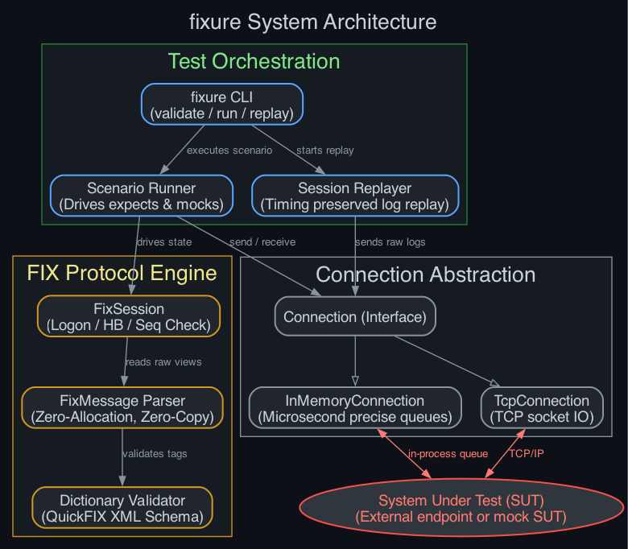

# fixure

**fixure** is an ultra-fast, zero-dependency, multiplatform C++23 test harness and mock container designed for rigorous validation of Financial Information eXchange (FIX) protocol implementations.

Built for performance-critical trading systems, **fixure** strips away the bloat of traditional GUI-heavy enterprise simulators, providing developers with a scriptable, deterministic, and microsecond-precise environment to test session states, application workflows, and boundary conditions.




## Key Features

* **Zero-Allocation, Zero-Copy Parsing:** Operates directly on raw network buffers using `std::string_view` boundaries. It validates `Tag=Value` fields, checksums, and body lengths without intermediate heap allocations, ensuring testing infrastructure never introduces artificial latency or artificial resource bottlenecks.
* **Declarative Scenario Scripting:** Define test cases using a minimal, readable Domain Specific Language (DSL) or standard QuickFIX XML data dictionaries. Explicitly declare sequence states, expected fields, repeating groups, and automatic mock responses (e.g., simulating order fills, sequence-number resets, or network gap recovery).
* **Nix-Native Architecture:** Ships with a fully declarative `flake.nix`. Get an identical, reproducible development shell and build pipeline instantly on Linux and macOS with a single command (`nix develop`), completely isolating compiler flags and toolchains.
* **Multiplatform & Modern C++:** Pure, low-dependency C++23 code. Compiles out-of-the-box using standard toolchains (GCC, Clang, MSVC) across Linux, macOS, and Windows.
* **Deterministic Session Replay:** Record live production or QA network logs and replay them into your system under test, allowing deterministic reproduction of edge-case racing conditions or protocol violations.

## Why fixure?

Most modern FIX testing utilities are either enterprise-wrapped Java applications that drag along a massive footprint, or Python/scripting wrappers that fail when subjected to realistic stress-testing throughput. **fixure** bridges the gap. It treats test fixtures as first-class, high-performance infrastructure—giving you the bare-metal speed required to fuzz endpoints and validate spec compliance at scale, while keeping your environment entirely lean and reproducible.

## Getting Started

### Prerequisites

You can set up all compilers and build dependencies instantly using [Nix](https://nixos.org/):

```bash
nix develop
```

This starts a shell with `cmake`, `ninja`, `clang-tools`, and `lldb`.

### Building and Testing

Configure and compile the project using CMake:

```bash
cmake -B build -G Ninja
cmake --build build
```

Run the unit test suite:

```bash
./build/fixure_tests
```

## Usage

### Command Line Interface (CLI)

The `fixure` binary provides three primary commands:

#### 1. Validate a FIX Message
Parse, view, and validate a FIX message string or file. You can optionally provide a QuickFIX XML data dictionary for schema validation:
```bash
./build/fixure validate "8=FIX.4.2|9=42|35=A|49=SENDER|56=TARGET|34=1|98=0|108=30|10=188|" --separator "|" --dict spec/FIX42.xml
```

#### 2. Run Scenario Scripting
Execute a scenario script against a System Under Test (SUT) listening on a TCP port:
```bash
./build/fixure run scenario.fixure 127.0.0.1 5001
```

#### 3. Deterministic Log Replay
Replay recorded FIX logs to a SUT, optionally preserving the original timing delay between messages:
```bash
./build/fixure replay production.log 127.0.0.1 5001 --preserve-timing
```

---

### Scenario Scripting DSL

Scenarios are defined in simple, human-readable `.fixure` files:

```txt
# Connect to the SUT
CONNECT

# Send a Logon message
SEND   35=A | 98=0 | 108=30

# Expect Logon message back
EXPECT 35=A

# Register a mock responder: if SUT sends a New Order Single (35=D), automatically reply with an Execution Report (35=8, 39=2)
MOCK   35=D | 35=8 | 39=2 | 150=2

# Wait for the Execution Report to be received
EXPECT 35=8 | 39=2

# Terminate session
DISCONNECT
```

---

### C++ API

#### Parsing Messages (Zero-Allocation, Zero-Copy)
```cpp
#include <fixure/parser.hpp>
#include <iostream>

void handle_packet(std::string_view network_buffer) {
    auto result = fixure::FixMessage::parse(network_buffer);
    if (!result) {
        std::cerr << "Invalid FIX packet: " << fixure::to_string(result.error()) << "\n";
        return;
    }

    const auto& msg = *result;
    std::cout << "MsgType: " << msg.get_field(35).value_or("unknown") << "\n";
    
    if (auto cl_ord_id = msg.get_field(11)) {
        std::cout << "ClOrdID: " << *cl_ord_id << "\n";
    }
}
```

#### Parsing Repeating Groups
```cpp
auto group = msg.get_group(78, 79); // NoAllocs=78, FirstTag=79
for (size_t i = 0; i < group.count; ++i) {
    auto acc = group.instances[i].get_field(79);
    auto qty = group.instances[i].get_field(80);
}
```

#### Fluent Scenario Builder
```cpp
#include <fixure/scenario.hpp>
#include <fixure/runner.hpp>

void run_test() {
    auto scenario = fixure::Scenario("Logon Flow")
        .connect()
        .send({ {35, "A"}, {108, "30"} })
        .expect({ {35, "A"} })
        .disconnect();

    fixure::SessionConfig config{
        .sender_comp_id = "CLIENT",
        .target_comp_id = "SERVER"
    };
    fixure::FixSession session(config);
    auto conn = std::make_shared<fixure::TcpConnection>("127.0.0.1", 5001);
    
    fixure::ScenarioRunner runner(session, conn);
    auto result = runner.run(scenario);
    if (result.success) {
        std::cout << "Test passed!\n";
    }
}
```


